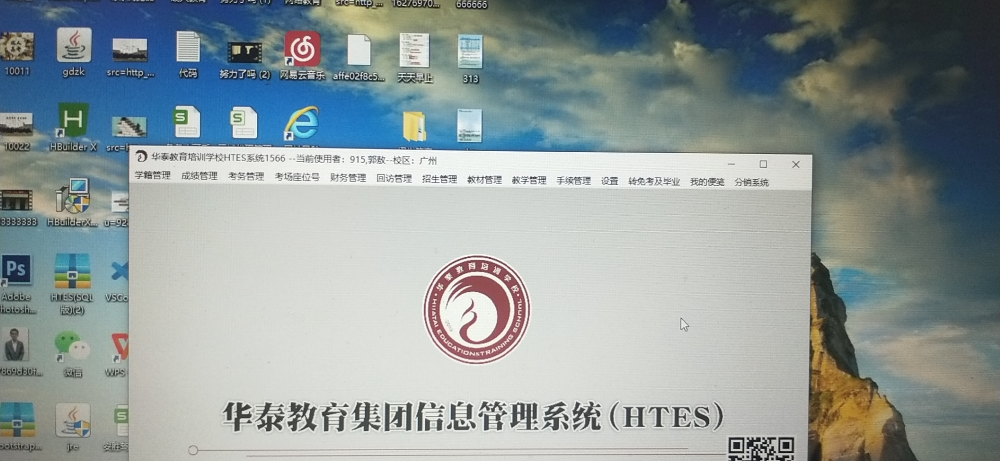

### 框架

1. QT

2. GuiLite

   > 引用方便的 C++ 全平台 GUI 库。能够使用在 PC 端、移动设备、物联网设备甚至是没有操作系统的单片机，还支持多种开发语言和三方库

   https://github.com/idea4good/GuiLite

其他

> 1. https://github.com/ChungZH/notepanda
> 2. 

### Github项目相关

1. 学生信息管理系统

   [Xiaoyuan-Liu/Student-Information-Manage-System: QT实现的学生信息管理系统，高程大作业](https://github.com/Xiaoyuan-Liu/Student-Information-Manage-System)

2. [triumphalLiu/Student_Infomation_Management_System: 学生信息管理系统_C++/Qt实现](https://github.com/triumphalLiu/Student_Infomation_Management_System)

3. [chenyongzhe/Qt-studentmanager: C++ Qt 基于数据库Mysql学生信息管理系统](https://github.com/chenyongzhe/Qt-studentmanager)

### 基本功能

